#  R.W JOINERY
# Introduction

 This is a fictional website based on my current job working as a joiner/carpenter. This website will advertise bespoke joinery catered to the customers needs. It will advertise an array of different joinery skills and projects that i have completed in my 13 years as a joiner, showcasing stairs, windows, kitchens, doors and anything that may have been produced by myself.

The website will cater to customers that desire handmade craftsmanship and joinery, that is fulfilled to a high standard and with great care. The website will reflect this through previous customer feedback and photographic evidence. Through the information provided this should give the customer a good understanding of the quality of work being provided, and lead them to contact us. 
  
   
   

Go to the live site here:https://washer143.github.io/r.wjoinery-msp1/

# User Experience (ux)

## User goals:
* Easy navigation throughout the site
* The site easily displays its intent as a joinery shop offering services 
* It engages and encourages customers to investigate and look through services page
* Provides rudimentary steps to get in contact and get a quote
* Clear and inviting photography presenting joinery work and skills that can be provided
* It's visually appealing and inviting for user experience
* Well structured and informative giving confidence for first time users
* The website is responsive, viewable and accessible on all screen-sizes 
* Information on business location and opening hours
* links to follow on social media

## Business goals:
* Creating an online presence to grow our local customer base
* Providing easy access to contact the business 
* Growing our social media following
* Access for disabled users
* Information is intuitive to follow 
* It provides customers with a feeling of warmth and reliability 
* To give customers confidence in our services, show positive customer feedback reports

# Website Design

## Structure

The website will be easy to navigate and user friendly, with a recognizable navbar and links to lead them from one page to the other seamlessly. The website will consist of 4 pages, they are as follows:

* Home: This will consist of initial information about what services we can offer.
* About us: This will consist of details of our experience, expertise and our workshop.
* services: This will showcase what we can offer in terms of joinery and design.
* contact us: A contact page to provide guests with information of our location and contact details and a form to submit if they wish to get in contact.

## Colors 

For my color scheme i've chosen to use grey and black for contrast in the header and footer to give a modern touch, then for the body i chose an off white color to make it easy on the eyes and to give a feeling of warmth and contentment. This is what i would hope the user would sense. I chose to use a white padding around every photo to make them stand out, also to give the writing more body. Then theres a theme of a dark red and gold color running throughout, for the headers and logo and certain features, creating a continuous theme throughout, keeping familiarity to the user.

## Fonts
 The font used throughout the project are "lato" and "mukta", I chose these fonts as i felt they had a crispness and modern feel to it, to make them stand out. I made sure to have them #000000 black and increased the weight on the font where necessary to give it more projection and readability.

## Wireframes
  balsamiq was used to initiate website design and ideas. you can view all design ideas from mobile, tablet to desktop here. [wireframes](./wireframes/)

## Home page
 * The home page features a hero image with text overlay, a slogan and title explaining what we offer as a business. Giving the user the desired information through text and imagery identifying our USP. 
 
 * Below the hero image we'll show a snippet of our services to intrigue and invite the user to investigate further and navigate throughout the website. 

 * As the user scrolls further they'll be introduced to a section on previous customer reviews, further accentuating a feeling of positivity and comfort in the service that they could be provided.
 
 
 ## About Us
 * Hero image with about us text overlay to identify new page and give user familiarity.
 
 * This page contains two sections. First section will contain information about our experience and skills to provide the user with confidence and assure them of our qualities as a professional craftsman. We will also try and create rapport with the user telling them a story about our workshop and how we built the business.
 
 * The second part of this page we will provide progress bars to give users a visual cue of our abilities as a business and craftsmen.
 
 ## Services
 * hero image with text overlay to keep the same theme running through the website.

 * This page contains 6 sections relaying to different types of joinery that the user can refer to for they're own ideas and projects. With images and a descriptions running along each section to give the customer a better understanding of what we can do. It will also showcase our knowledge in craftsmanship in more detail giving confidence in the service we could provide.

 ## Contact Page
  * This page will feature a new hero image as a back drop to signify importance to get in contact.
  * The page has a form that the user can use to fill out they're name, e-mail, phone number and message, which are all required, with a submit button.
  * it also also has our address, email and phone number in larger writing for customers to clarify our details and for users with poor vision.

 # Existing Features and Testing (UX)
 ## Navigation & Logo
* The navbar and logo feature on all 4 pages, they're fully responsive and the logo acts as an active link to re-direct to the homepage, which i feel is a required function for user experience.
* All four pages, home, about us, services and contact us, as is common with web design are positioned to right, which gives user familiarity.
* All links turn a different color when hovered over to signify activity, and to click. Giving easy navigation to users.
* I designed the nav bar to match the footer with the same grey and black color theme to match the logo, but to also stand out, and make navigation a simple user experience.
   

 ## Footer
 * As a user i want to be able to identify useful information providing details on opening hours, address and links to social media sites. This content is usually situated on the footer.
 * The footer is displayed throughout all pages, with the address of our workshop to the left, opening hours displayed centrally and social media links displayed to the right, all of which are functional.  
 * The footer is fully responsive, as the screen becomes smaller, any content to the right will wrap underneath, with active social media links displayed to the bottom, followed by opening hours and address details stacking on one another.
 

## Home 
* As a user i want to be to intuitively navigate throughout the site from the homepage.
* This page shows off a snippet of our services section to entice customers, with customer reviews aligned beneath to give users positive re-enforcement. The services header is also active, just like the navbar, it changes color when hovered over, when clicked they will be re-directed straight to the services page. We also have a beautiful hero image of a man working on a lathe, this image lets users know that they've directed themselves to the right page.

### The main hero image that runs through three pages, Home, about us and services.

### Introduction to a snippet services section, with an active link which takes them straight to the full services page.

   

   

### Testimonials section for customer feedback.

## About us
* As a user i want know the people behind the business, gain insight into their experience,skills and personality.
* This page provides a deep insight to the owners skills and experience, with pictures aligned either side of each paragraph. A progress bar follows below giving a visual cue of customer satisfaction with the logo matching in color of theme of the body of the page. As a user i want get a feel for the business, and the people behind it, this is what this page hopefully achieves for the business, by getting more personal.

* This is the progress bar that follows beneath which is responsive:

## Services 
* As a user i want to see what other services can be offered in more detail.
* This page provides a more in depth look at our services, with 6 pictures with an array of joinery and carpentry work, we open the user to a body of work with which they can feel comfortable in our abilities, a descriptive paragraph follows each image.

## Contact us
* As a user i want to be be able to get in contact with the business and enquire about any services i would like.
* Containing a form block and address block, with a map spanning the width of the page beneath. This page strikes a different tone intentionally, aligning more with the navbar, footer and logo. This lets the user know they've landed on an important page, and to get in contact.

# Map
* As user i want to be able to locate where the workshop is situated.
* Spanning the entire width of the page, the map is easy to navigate for users.
 

## Future Features

* An additional portfolio/gallery page that shows off a greater display of work.
* pictures shown in the services section could be made more dynamic by using carousel to show before and after pictures.
* Use of a back to the top arrow to save scrolling time.
* Use of a hamburger button to reduce real estate on the navbar for smaller devices.
* A landing page for when users have submitted they're form.

 
# Manual Testing
## Navigation

* Navigation bar logo is active and responds to re-directing back to the homepage when clicking.
* Menu links are active and work as they should.
* The menu list turns yellow when hovered over which indicates functionality and responds as intended.
* The navbar is also fully responsive with menu list items wrapping beneath logo on smaller devices, working as intended.

## Home page

* On the home page the services button works as intended redirecting users to a more in depth look at services page.
* The hover function works as intended turning yellow once hovered over.

## About page

* We have a dynamic progress bar situated below our "Experience" and The workshop" write up. Its fully responsive and works as it should, with the progress bars reducing in size for smaller screens with the logo situated neatly above it.

## Services page

* The services section contains two rows of three images aligned next to each other with three columns separating the images. They wrap into rows of two images and then one as the screen size decreases working as intended.

## Contact page

* Contact form works as intended, all fields have to be have the sufficient data correctly entered for the form to submit.
* It submits correctly to Code Institute form dump with name, email, phone number and message all recorded as submitted.

# Testing User Stories
# Validation
* HTML Validator was run explicitly towards the end of project development. All issues that were identified have been fix'd, any changes that were made, i made sure to run it through again to make sure there were no miscellaneous code displaced. This may have been a mistake on my part to not run it through til end of my project, moving on to other projects i'll be sure to have more control and insight to my project by putting my code through from the start of building my project, therefore having more control in the process of building my webpage.

* CSS Validator and jigsaw validator was also run at the end phase of the project luckily finding no issues in my code.

* Lighthouse was run at the end of project development, as with validation, i unfortunately did not use light house to have more version control of my project, instead purely focusing on aesthetic design and trying to implement my vision with coding. Going forward i would make full use of lighthouse and fine tune my website as i go along, using lighthouse as a tool to edit/fix any issues, making for a better performing and more accessible website.

View lighthouse tests and validation tests here:

* [Lighthouse Report](/documentation/lighthouse%20tests/)

* [Validation Tests](/documentation/validation%20tests/)
 

# Browser Compatibility
The website was tested on the following browsers:
* Google Chrome
* Safari
* Mozilla Firefox

They all appeared as they should.

# Deployment
The website was deployed using github, these are the steps i followed.
* Login to github.
* click on settings tab placed above the green code button.
* On the left scroll to find "Pages" which will open up a new section.
* Go to source and select master branch.
* Once master branch has been selected, the page will give you a link indicating a successful deployment.
The link to the live website is here: https://washer143.github.io/r.wjoinery-msp1/

If you wish to clone the repository these are the steps to take:
* Go to github repository.
* Go to the code button located next to the gitpod button and click.
* Select if you want to clone with https, SSH or Github CLI. 
* Click button beside url to copy to clipboard
* Open with github desktop, and follow the prompts to complete the clone. 
* Alternatively you can open Git Bash and change the current working directory, to where you want a cloned directory.
* Type git clone in the terminal, paste the URL you copied earlier, and press “enter” to create your local clone.

If you want to fork the repository you can click the fork button located towards the top right of the page.

# Responsiveness

I started this project on my laptop, i therefore instinctively produced this project as a laptop version first project, which in hindsight i should have given more thought to, but at the time i felt it would be the best way to implement my ideas and then scale down, not that there is a problem with this option, but as i came to learn in media queries, i ran into a multitude of issues. After painstakingly adding and editing code, i finally got it to respond the way i wanted to, from laptop, tablet to mobile device. However for much larger desktop screens i need to tweak the project, by doing a four grid layout system, so there's enough material to span across the page. This is something to consider for future projects.

 
# Bugs
* when i initially started my project i decided to go with a grid layout as this best suited my design, so i used mainly css grid rather than flexbox to layout my content. i had a torrid time figuring out why my grid wasn't being responsive. Eventually taking the time to read thoroughly through https://css-tricks.com/snippets/css/complete-guide-grid/ i sourced a snippet of code that could be the solution to my problems. The code i was using before.

* As good as it is for designing page layout, it simply wasn't responsive when reducing the page width.
  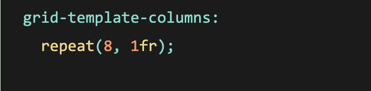

* Initially i didn't think this worked either, but after playing around with minmax width and changing my fraction to 3 instead of 1, it finally started to click into place.

  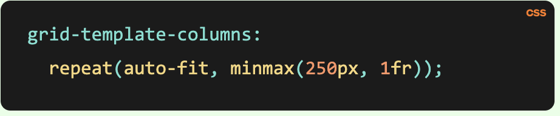

* The testimonials section was not correctly aligned with the services section home page.

  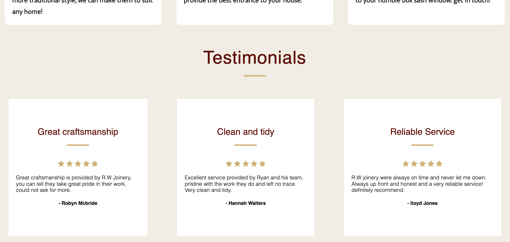

* Originally i used flexbox to display it as a row, i fixed this by turning it into a grid in css.

   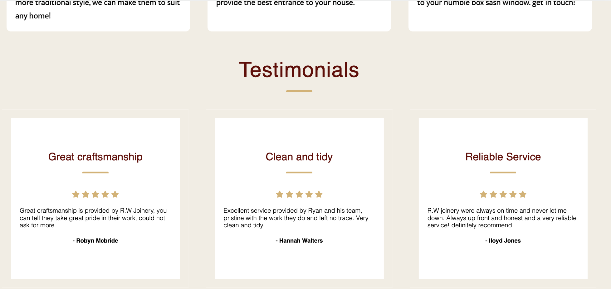
 
   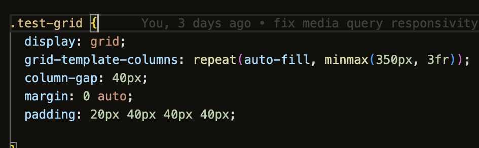
 
   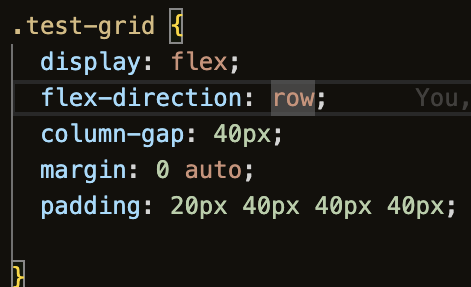

* Images were not rendering to full capacity when the viewport width got bigger leaving white space with their cells, to fix this i added a 100% width targeting images in media query, to be fully responsive.

  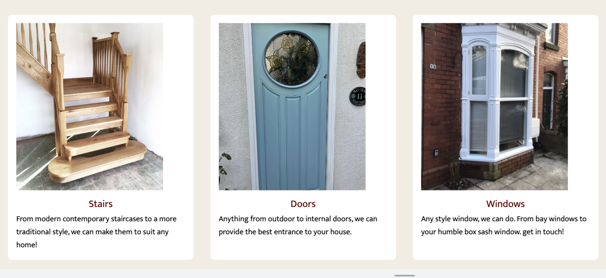
  
  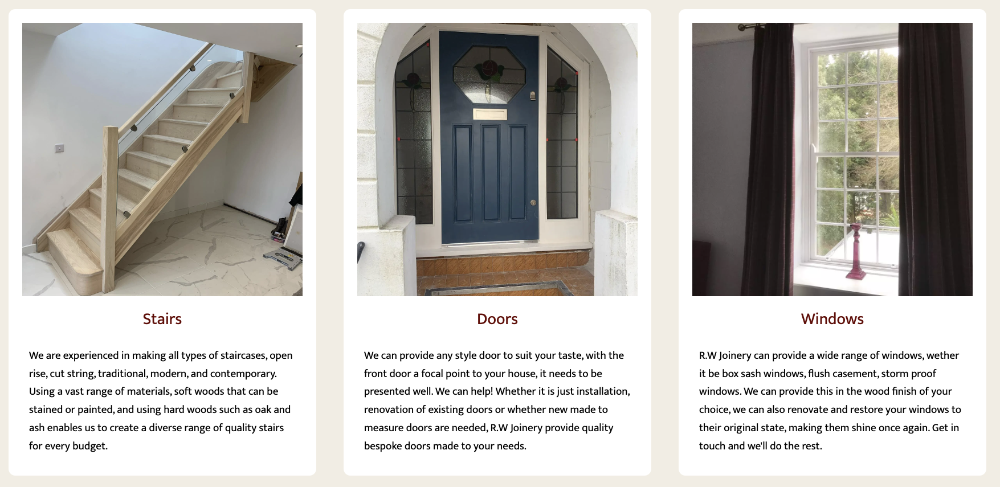

* The navbar menu when viewed on small screens would fall in to two rows with the logo situated above. To fix this i targeted 
nav list elements in media query to reduce padding and font size to give them enough space to align in a row correctly.

  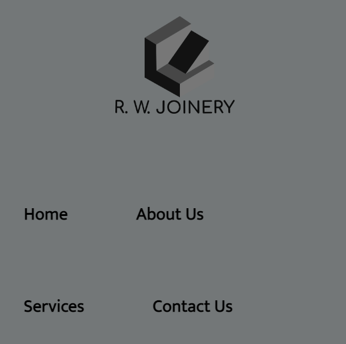
  
  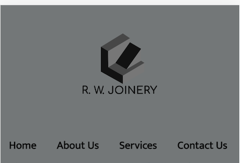

* When viewing the webpages on medium to small tablet devices, i encountered issues with there being not enough real estate for two pictures to align next to each other, to fix this in media query i reduced padding to zero and gave a background color of white. This fix'd the issue quite nicely and gives the images enough space to sit next to each other.

  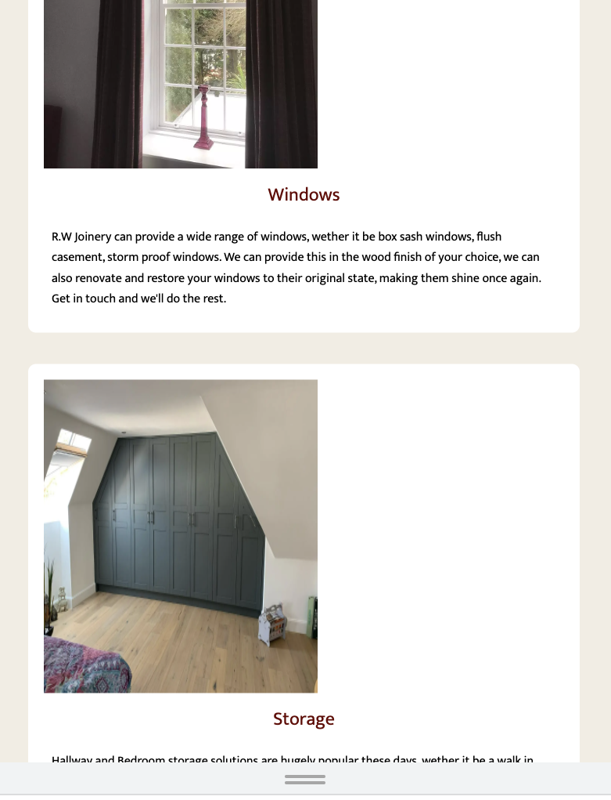
  
  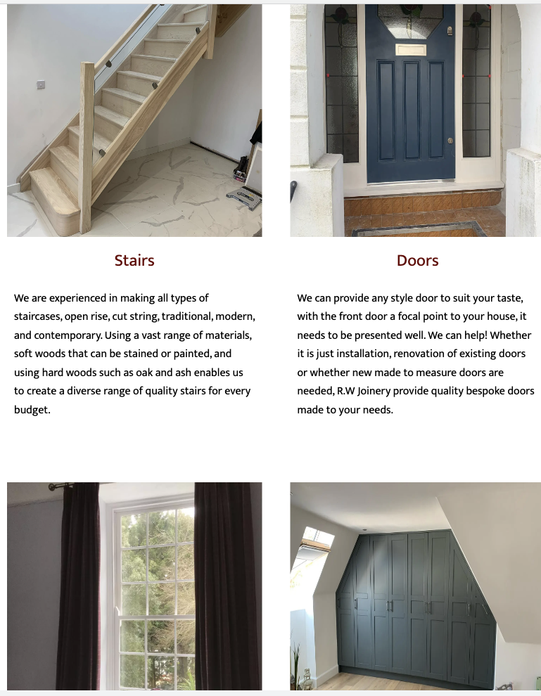

# Unfixed Bugs
There are still some bugs that still need to be addressed unfortunately, i wasn't able to find a solution, hopefully through more knowledge and understanding i can tackle these in the future. They are as follows.

* The navbar on very small screens still folds onto another line, with contact us folding beneath the home button. I would like to work around this by using a a burger menu, i will address this when i have gained the skills necessary to build one.

* The footer is responsive but theres a certain viewport width where the social media links start to disappear, and then when small enough, it will fold beneath inline with opening hours and the address, this lag was concerning to me but i could not find a solution that was any better than what i produced.

* There is slight misalignment issues with the address logo on the contact page. When reduced to a very small screen it appears off centre, i tried to address this in media queries using margin to centre it as much as possible, when getting reduced down. This was the the best solution i could find to the issue.

 # Languages Used
 * HTML (Html was used for basic )
 * CSS  (CSS was used for for styling and web )

 # Websites & tools
 * [Wireframes](https://balsamiq.com/) (for wireframes and initial development ideas)
 * [Coolors](https://coolors.co/) (for color palette inspiration)
 * [Google Fonts](https://fonts.google.com/) (to choose the right fonts for my project)
 * [Google Maps](https://www.google.com/maps/) (to provide map for contact page)
 * [Fontawesome](https://fontawesome.com/)(for icons throughout project)
 * [GitHub](https://github.com/) (to store my repository)
 * [Gitpod](https://www.gitpod.io/) (to build my project and write code)
 * [Git](https://git-scm.com/) (for version control)
 * [freeconvert](https://www.freeconvert.com/)(to convert my png pictures to webp)
 * [W3C](https://validator.w3.org/) (Used to validate all my code)
 

## Credits

* [WC3](https://www.w3.org/) helped with star rating on testimonials and progress-bars on about page.
* [Stack Overflow](https://stackoverflow.com) Used throughout project to troubleshoot.
* [Youtube](https://youtube.com) Found lots of helpful videos to learn from and simplify code for me, during sticking points throughout the project.
* [Slack](https://slack.com) Used to reference and compare with other people's work. 
* [Bay-joinery](bay-joinery.co.uk) I used this site as my main source of inspiration to build my website.

## Photos

photos were used from [unsplash](https://unsplash.com/)

* [Hero image](/assets/images/austin-ramsey-nmXi-HCD_F8-unsplash.webp) for the home, about and services page - Austin Ramsey
* [Hero image contact](/assets/images/benjamin-thomas-idEEZ-wQkfA-unsplash.webp) for contact page - Benjamin Thomas

All other photos were sourced by the developer.
## Takeaway
This project was a steep learning curve, but through the struggle comes a better understanding of how it all works. Ive taken away a much deeper understanding of the process and how to carefully curate your project. I've gained far more knowledge of how CSS Grid and Flexbox work and look forward to building my skills with these styles, utilizing google chrome developer tools was a great way to navigate your way through hard challenges and to understand what functions work, and how you are affecting them with your code.

## Acknowledgements

I'd like to thank my mentor Mitko Bacharov for guiding me in the right direction, and pointing out all the bugs that i needed fixing. The online tutor team were also of great support in helping me de-bug some issues.

I'd like to thank my brother-in law who owns bay-joinery which gave me my main source of inspiration, and whom ive had the pleasure of working with over the last few years in the trade.

I'd also like to thank my long suffering partner for her support, and patience.

 

   
