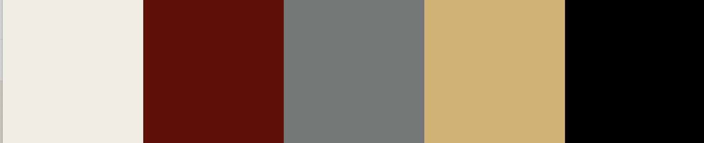
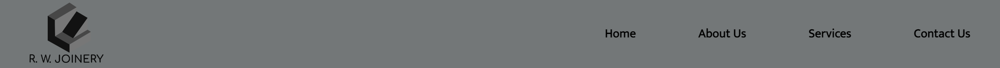
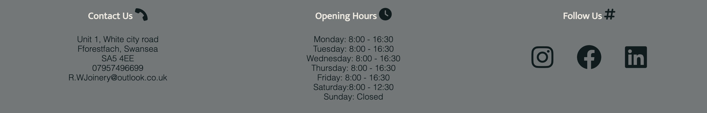
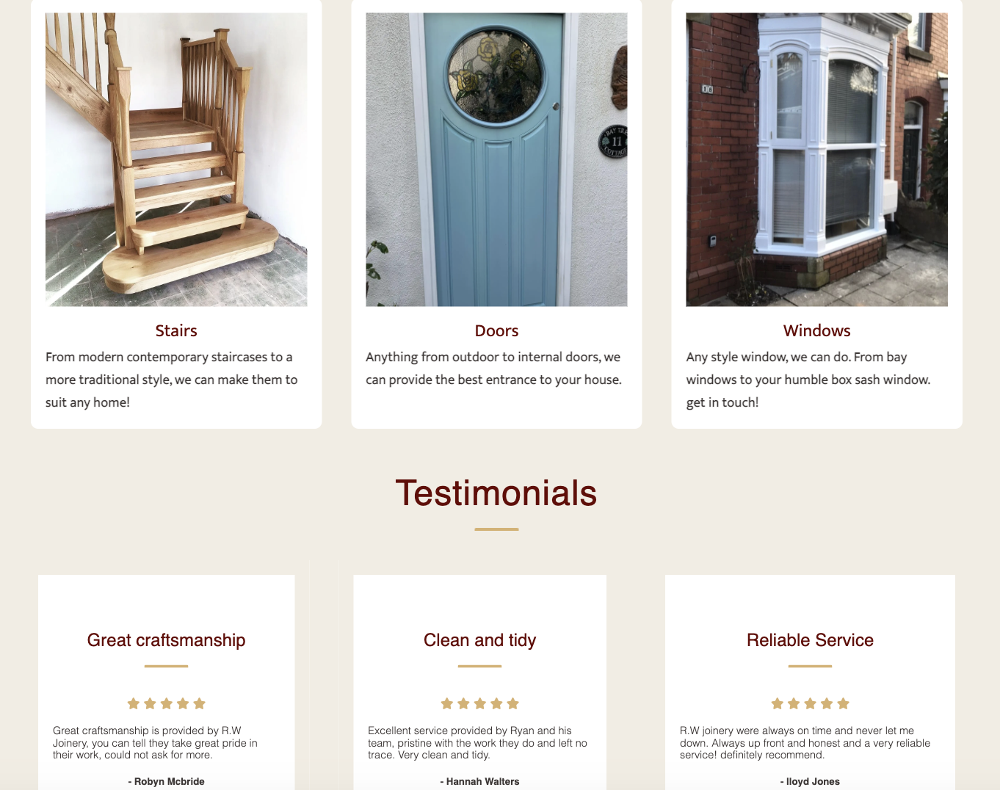
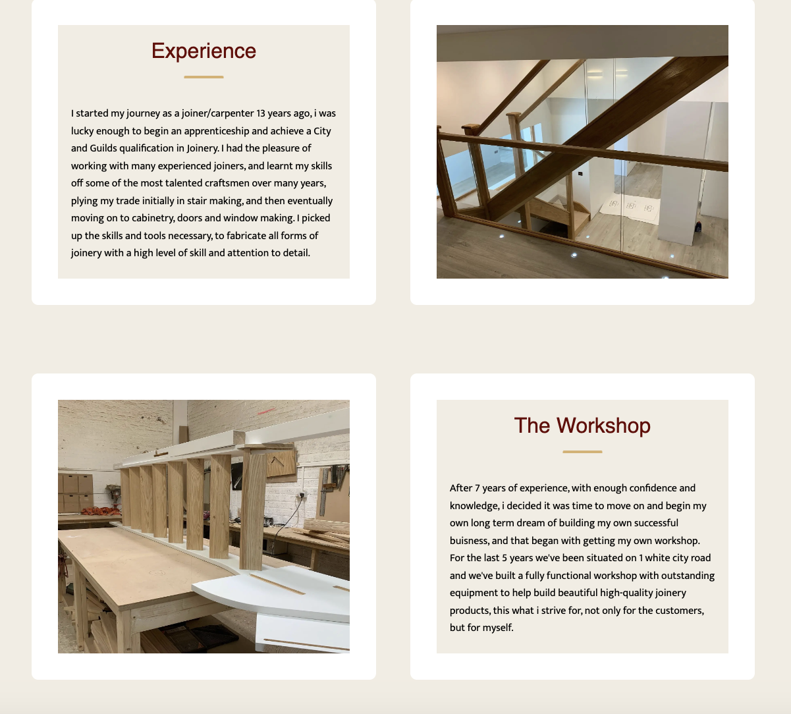
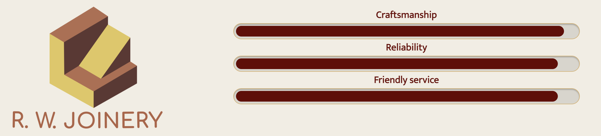
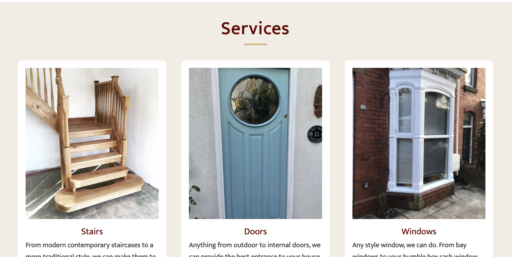
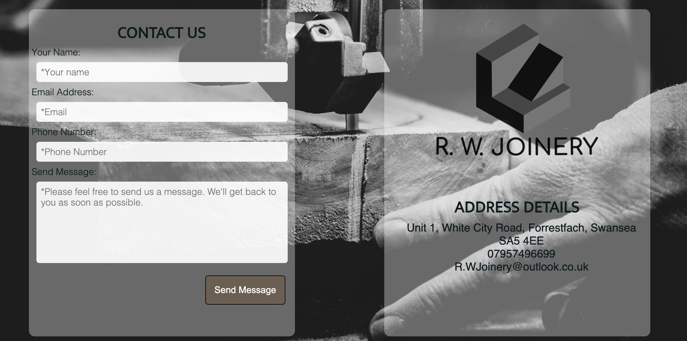
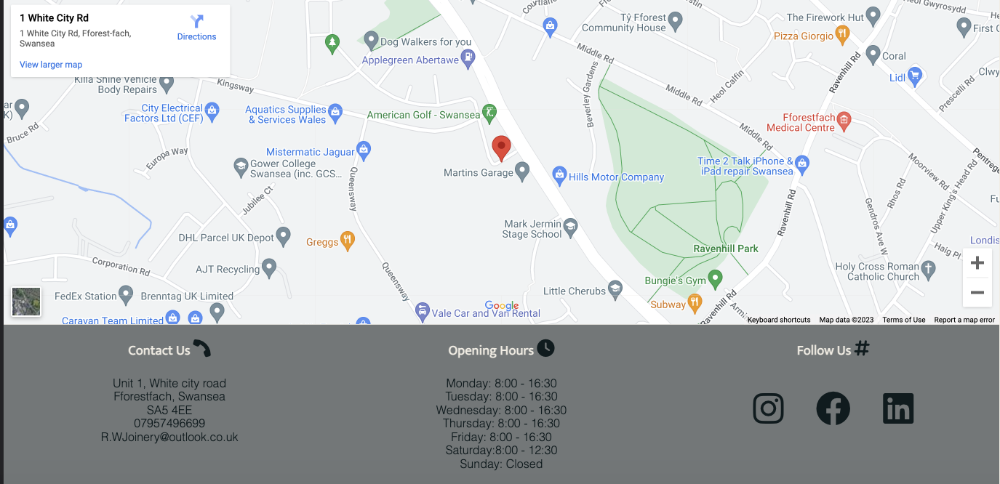

#  R.W Joinery
# Introduction

 This is a fictional website based on my current job working as a joiner/carpenter. This website will advertise bespoke joinery catered to the customers needs. It will advertise an array of different joinery skills and projects that i have completed in my 13 years as a joiner, showcasing stairs, windows, kitchens, doors and anything that may have been produced by myself.

The website will cater to customers that desire handmade craftsmanship and joinery, that is fulfilled to a high standard and with great care. The website will reflect this through previous customer feedback and photographic evidence. Through the information provided this should give the customer a good understanding of the quality of work being provided, and lead them to contact us. 
  
   
# User Experience (ux)

## User goals:
* Easy navigation throughout the site
* The site easily displays its intent as a joinery shop offering services 
* It engages and encourages customers to investigate and look through services page
* Provides rudimentary steps to get in contact and get a quote
* Clear and inviting photography presenting joinery work and skills that can be provided
* It's visually appealing and inviting for user experience
* Well structured and informative giving confidence for first time users
* The website is responsive, viewable and accessible on all screen-sizes 
* Information on business location and opening hours
* links to follow on social media

## Buisness goals:
* Creating an online presence to grow our local customer base
* Providing easy access to contact the buisness 
* Growing our social media following
* Access for disabled users
* Information is intuitive to follow 
* It provides customers with a feeling of warmth and reliability 
* To give customers confidence in our services, show positive customer feedback reports

# Website Design

## Structure

The website will be easy to navigate and user friendly, with a recognizable navbar and links to lead them from one page to the other seamlessly. The website will consist of 4 pages, they are as follows:

* Home: This will consist of initial information about what services we can offer.
* About us: This will consist of details of our experience, expertise and our workshop.
* services: This will showcase what we can offer in terms of joinery and design.
* contact us: A contact page to provide guests with information of our location and contact details and a form to submit if they wish to get in contact.

## Colors 

For my color scheme i've chosen to use grey and black for contrast in the header and footer to give a modern touch, then for the body i chose an off white color to make it easy on the eyes and to give a feeling of warmth and contentment. This is what i would hope the user would sense. Then theres a theme of a dark red and gold color running throughout, for the headers and logo.

 ## Home page
 * The home page features a hero image with text overlay, a slogan and title explaining what we offer as a business. Giving the user the desired information through text and imagery identifying our USP. 
 
 * Below the hero image we'll show a snippet of our services to intrigue and invite the user to investigate further and navigate throughout the website. 

 * As the user scrolls further they'll be introduced to a section on previous customer reviews, further accentuating a feeling of positivity and comfort in the service that they could be provided.
 
 
 ## About Us
 * Hero image with about us text overlay to identify new page and give user familiarity.
 
 * This page contains two sections. First section will contain information about our experience and skills to provide the user with confidence and assure them of our qualities as a professional craftsman. We will also try and create rapport with the user telling them a story about our workshop and how we built the business.
 
 * The second part of this page we will provide progress bars to give users a visual cue of our abilities as a business and craftsmen.
 
 ## Services
 * hero image with text overlay to keep the same theme running through the website.

 * This page contains 6 sections relaying to different types of joinery that the user can refer to for they're own ideas and projects. With images and a description running along each section to give the customer a better understanding of how they could utilize for themselves. It will also showcase our knowledge craftsmanship in more detail.

 ## Contact Page
  * This page will feature a new hero image as a back drop to signify importance to get in contact.
  * The page has a form that the user can use to fill out they're name, e-mail, phone number and message, which are all required, with a submit button.
  * it also also has our address, email and phone number in larger writing for customers to clarify our details and for users with poor vision.
  
 # Features
 
 ## Navigation & Logo
* The navbar and logo feature on all 4 pages, they're fully responsive and the logo acts as an active link to re-direct to the homepage, which i feel is a required function for user experience.
* All four pages, home, about us, services and contact us, as is common with web design are positioned to right, which gives user familiarity.
* All links turn a different color when hovered over to signify activity, and to click. Give easy navigation to users.
* I designed the nav bar to match the footer with the same grey and black color theme to match not only the logo but to also stand out, and make for an easier user experience.
   

 ## Footer
 * The footer is displayed throughout all pages, with the address of our workshop to the left, opening hours displayed centrally and social media links displayed to the right. 
 * The footer is fully responsive, as the screen becomes smaller any content to the right will wrap underneath, with social media links displayed to the bottom, followed by opening hours and address details stacking on one another.

## Home 
* This page shows off a snippet of our services section to entice customers, with customer reviews aligned beneath. The services header is also active, so as with the navbar, it changes color when hovered over, when clicked they will be re-directed straight to the services page.

## About us
* This page provides a deep insight to the owners skills and experience, with pictures aligned either side of each paragraph. A progress bar follows below giving a visual cue of customer satisfaction with the logo matching in color theme.

* Following this, the progress bar which is responsive:

## Services 
* This page provides a more in depth look at our services, with 6 pictures of varying joinery and carpentry work, we open the user up to a body of work with which they can feel comfortable in our abilities, a descriptive paragraph follows each image.

## Contact us
* Containing a form block and address block, with a map spanning the width of the page beneath. This page strikes a different tone intentionally, aligning more with the navbar, footer and logo. 

# Map
* Shows our location, if users should want to visit.
 

## Future Features
* An additional portfolio/gallery page that shows off a greater display of work.
* pictures shown in the services section could be made more dynamic by using carousel to show before and after pictures.
* Use of a back to the top arrow the save scrolling time.
* Use of a hamburger button to reduce real estate on the navbar for smaller devices.

   

  

## Wireframes
 * balsamiq was used to initiate website design and ideas. you can view the wireframes in my documentation.

# Testing
## Validation
## Responsiveness
 # Languages
 * HTML
 * CSS

 # Websites & tools
 * Balsamiq
 * Coolors.com
 * Google Fonts
 * Font Awesome
 * Github
 * Gitpod
 * Git
 * freeconvert.com
 * 

 

   
